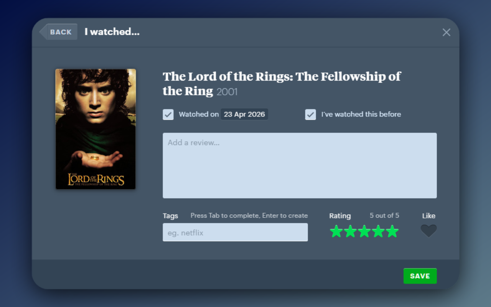
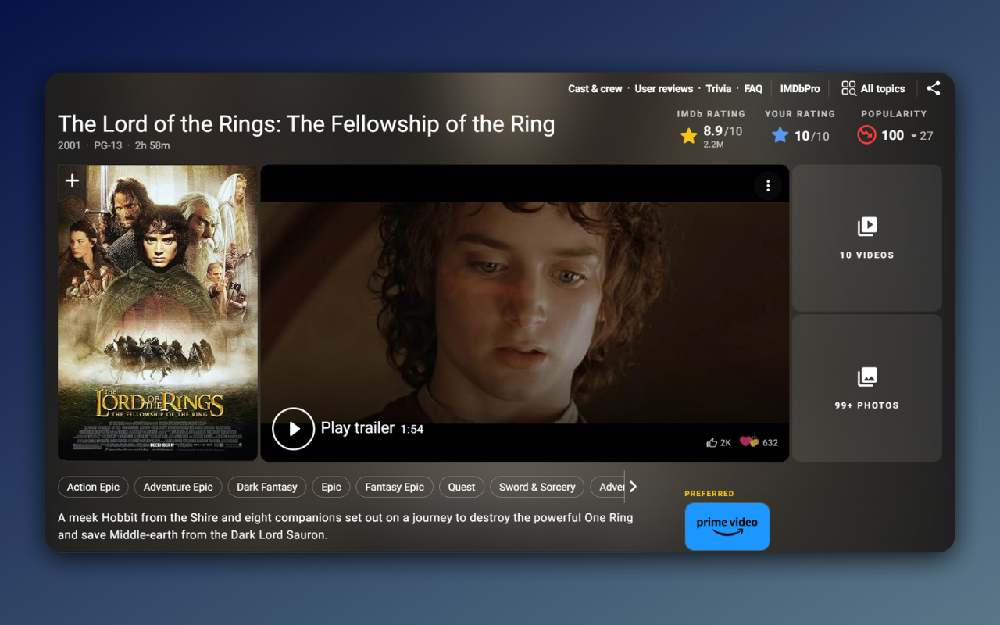

# RateSync

**Sync Letterboxd Rating to IMDb — automatically.**

RateSync is a Chrome extension that submits your Letterboxd rating to IMDb the moment you rate a film. No extra clicks, no switching tabs. Rate once, done on both.

---

## How It Works

1. You rate a film on Letterboxd (film page or log/diary dialog)
2. RateSync detects the rating in the background
3. It resolves the film's IMDb ID via Letterboxd's film data (with TMDb as fallback)
4. It submits the equivalent rating to IMDb using your existing session
5. The sync is logged in the popup — green for success, red for failure

Letterboxd's 5-star scale is converted to IMDb's 10-point scale automatically.

---

## Features

- Automatic background sync — no interaction needed
- Works from both the film page and the log/diary dialog
- Sync log with film title, star rating, and timestamp
- Stats bar — total synced, success rate, average rating
- Filter by failed syncs or unique films only
- Auto-open IMDb page after each sync (optional)
- TMDb fallback for films without a direct IMDb link on Letterboxd
- IMDb login status indicator in the header

---

## Screenshots

| Letterboxd                                 | IMDb                           |
| ------------------------------------------ | ------------------------------ |
|  |  |

---

## Requirements

- Google Chrome
- A [Letterboxd](https://letterboxd.com) account
- An [IMDb](https://www.imdb.com) account — must be logged in on the same browser profile
- A [TMDb API Read Access Token](https://www.themoviedb.org/settings/api) (free) — only needed as fallback for films Letterboxd doesn't directly link to IMDb

---

## Installation

### From Chrome Web Store

_(Coming soon)_

### Manual (Developer Mode)

1. Clone or download this repo
2. Open `chrome://extensions/`
3. Enable **Developer mode**
4. Click **Load unpacked** and select the `ratesync/` folder

---

## Setup

1. Log in to [IMDb](https://www.imdb.com) in your browser — the extension uses your existing session
2. Click the RateSync icon and open **Settings**
3. Paste your [TMDb API Read Access Token](https://www.themoviedb.org/settings/api) (free — select _Personal Use_ when applying)
4. Rate a film on Letterboxd — the sync happens automatically

---

## Privacy

- Runs entirely in your browser — no external servers, no analytics, no tracking
- Your TMDb token is stored locally and only sent to TMDb for film ID lookups
- Your IMDb session is used only to submit your rating — never stored or shared
- Full privacy policy: [privacy-policy.md](.claude/privacy-policy.md)

---

## Disclaimer

This extension is not affiliated with Letterbox or IMDb. Use it at your own risk

## License

MIT
